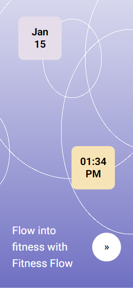

# FitnessFlow: Our Journey to Building a Fitness Tracking App

We've always been passionate about fitness and staying active, but we found it difficult to keep track of our progress and stay motivated. We wanted a way to easily track our workouts, set goals, and see our progress over time. That's what inspired us to build FitnessFlow.

## Tech Stack Used

For this project we use nextjs with typescript and eslint for Single Page Application(SPA) and firebase for authentication and storage.

## Getting Started

Install requirements:

```bash
npm install
# or
yarn
```

Then, run the development server:

```bash
npm run dev
# or
yarn dev
```

Open [http://localhost:3000](http://localhost:3000) with your browser to see the application.

# Images


[]()

## Learn More

To learn more about Next.js, take a look at the following resources:

- [Next.js Documentation](https://nextjs.org/docs) - learn about Next.js features and API.
- [Learn Next.js](https://nextjs.org/learn) - an interactive Next.js tutorial.

You can check out [the Next.js GitHub repository](https://github.com/vercel/next.js/) - your feedback and contributions are welcome!
